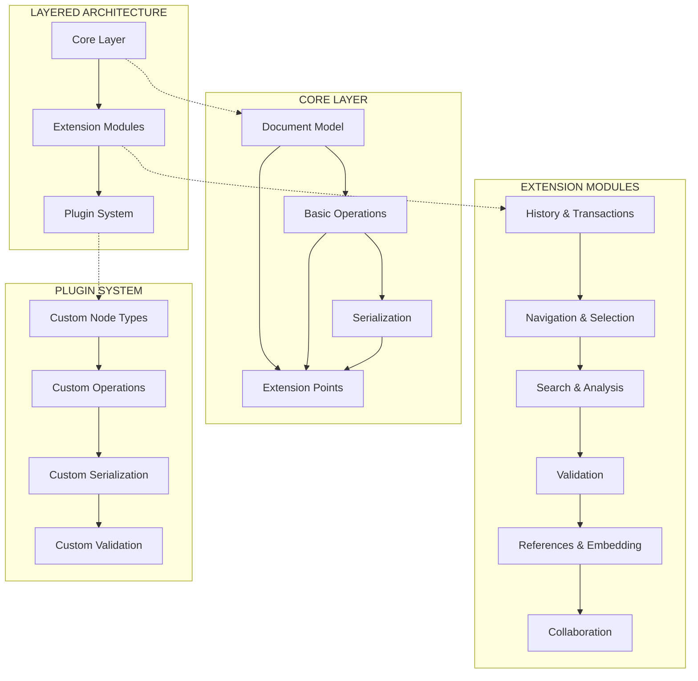

# Architecture Decision Record: Layered Architecture

## Context
After analyzing the current implementation and identifying additional core functionalities needed for a comprehensive markdown editor library, we need to define an architecture that supports these features while maintaining backward compatibility and allowing for future expansion.

## Component Analysis

### Current Components
- **Document Model** (`document.rs`, `node.rs`, `inline.rs`)
  - Represents the hierarchical document structure
  - Provides basic document manipulation operations

- **Selection Model** (`selection.rs`)
  - Basic cursor and selection representation
  - Limited cursor movement functionality

- **Serialization** (`serialization.rs`)
  - Converts between document model and various formats
  - Currently supports JSON, Markdown, and HTML

### Required New Components
- **History & Transactions**
  - Transaction-based editing system
  - Undo/redo functionality

- **Advanced Selection & Navigation**
  - Enhanced cursor movement
  - Structure-aware selection operations

- **Search & Analysis**
  - Document searching capabilities
  - Content analysis tools

- **Validation**
  - Schema-based validation
  - Content linting and suggestions

- **Extension System**
  - Plugin architecture
  - Custom node types and operations

## Architecture Options

### Option 1: Modular Extension of Current Architecture
Extending the current architecture with optional modules for each feature group.

**Pros:**
- Maintains backward compatibility
- Users can opt-in to specific functionality
- Controlled growth of core library size

**Cons:**
- Potential integration challenges between modules
- Could lead to inconsistent API design
- Overhead in managing dependencies between modules

### Option 2: Integrated Comprehensive API
Building all functionality into an integrated API with a cohesive design.

**Pros:**
- Consistent API experience
- Better integration between features
- Simpler mental model for users

**Cons:**
- Larger core library size
- All users get all features whether needed or not
- Potentially higher complexity for simple use cases

### Option 3: Layered Architecture with Core/Extensions
A minimal core with well-defined extension points and official extension packages.

**Pros:**
- Clean separation of concerns
- Users can include only what they need
- Easier to maintain and evolve
- Better testability

**Cons:**
- Requires careful API design for extension points
- Potential version compatibility issues between extensions
- Initial design more complex

## Decision
**Chosen Option:** Option 3 - Layered Architecture with Core/Extensions

This architecture provides the best balance between flexibility and cohesion, allowing for controlled growth without bloating the core library. It aligns with Rust ecosystem practices and enables specialized extensions for different use cases.

## Detailed Architecture Design

### Core Layer
The foundational layer providing essential functionality:

1. **Document Model**
   - Document, Node, InlineNode structures
   - Basic document representation
   - Minimal manipulation operations

2. **Basic Operations**
   - Essential editing operations
   - Basic cursor and selection handling
   - Simple document modification

3. **Serialization**
   - Format conversion (JSON, Markdown, HTML)
   - Basic import/export functionality

4. **Extension Points**
   - Trait definitions for extensions
   - Event system for document changes
   - Plugin registration mechanism

### Extension Modules
Optional modules that extend core functionality:

1. **History & Transactions**
   - Transaction recording and replay
   - Undo/redo stack
   - Command pattern implementation

2. **Navigation & Selection**
   - Advanced cursor movement
   - Multi-cursor support
   - Structure-aware selection

3. **Search & Analysis**
   - Text search functionality
   - Document statistics
   - Content analysis tools

4. **Validation**
   - Schema validation
   - Content linting
   - Error reporting

5. **References & Embedding**
   - Footnotes and citations
   - Document fragments
   - Embedded content

6. **Collaboration**
   - Operational transformation
   - Comments and annotations
   - Change tracking

### Plugin System
Extensibility framework for custom functionality:

1. **Custom Node Types**
   - Define specialized node types
   - Custom rendering hints
   - Domain-specific elements

2. **Custom Operations**
   - Specialized document operations
   - Domain-specific transformations

3. **Custom Serialization**
   - Support for additional formats
   - Specialized import/export

4. **Custom Validation**
   - Domain-specific validation rules
   - Custom linting rules

## Implementation Considerations

1. **API Design**
   - Define stable trait interfaces for extension points
   - Use Rust's feature flags for optional functionality
   - Ensure backward compatibility in core layer

2. **Dependency Management**
   - Minimize dependencies in core layer
   - Use semantic versioning for extension compatibility
   - Allow for optional dependencies based on features

3. **Performance**
   - Optimize core operations for efficiency
   - Use lazy loading for extension functionality
   - Ensure memory efficiency with large documents

4. **Testability**
   - Design for testability with dependency injection
   - Create comprehensive test suite for each layer
   - Support integration testing between layers

## Implementation Phases

1. **Phase 1: Core Layer Redesign**
   - Refactor existing code to support extension points
   - Define trait interfaces for extensions
   - Implement event system for document changes

2. **Phase 2: Essential Extensions**
   - History & transactions module
   - Enhanced selection & navigation
   - Basic search functionality

3. **Phase 3: Advanced Extensions**
   - Document statistics & analysis
   - Validation system
   - References & footnotes

4. **Phase 4: Collaboration Foundation**
   - Operational transformation primitives
   - Comments & annotations
   - Change tracking

5. **Phase 5: Plugin System**
   - Plugin registration mechanism
   - Custom node type support
   - Extension discovery and loading

## Validation

- **Requirements Met:**
  - ✓ Maintains backward compatibility
  - ✓ Supports all identified functionality
  - ✓ Provides extensibility
  - ✓ Keeps core library focused
  - ✓ Allows incremental adoption

- **Technical Feasibility:** High
  - Rust's trait system and feature flags provide good support
  - Clear implementation path with proven patterns
  - Builds on existing architecture strengths

- **Risk Assessment:** Medium
  - Careful API design required for extension points
  - Initial refactoring complexity
  - Potential for version compatibility challenges between extensions
