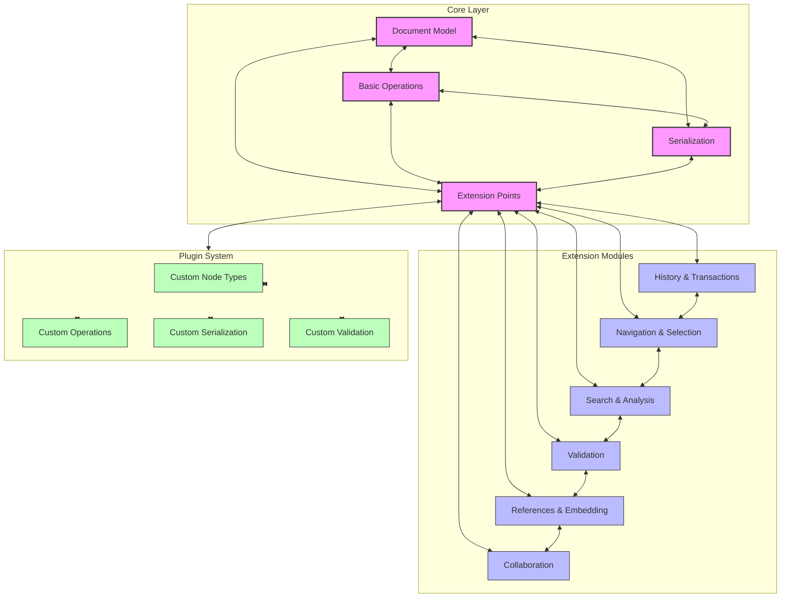

# 🎨🎨🎨 ENTERING CREATIVE PHASE: ARCHITECTURE DESIGN

## Layered Architecture for MD-Editor

This document provides detailed design specifications for the recommended layered architecture approach.

## Architecture Diagram



## Layer Responsibilities

### Core Layer
- **Document Model**: The fundamental data structures representing Markdown documents
  - Node and document tree representation
  - Position and selection primitives
  - Path-based addressing

- **Basic Operations**: Essential transformations on the document model
  - Node creation and modification
  - Tree structure manipulation
  - Cursor positioning and basic selection

- **Serialization**: Converting between Markdown text and the document model
  - Parsing Markdown into document model
  - Rendering document model to Markdown
  - Support for core Markdown syntax

- **Extension Points**: Interfaces for extending functionality
  - Node visitor infrastructure
  - Operation hooks
  - Event system for document changes
  - Plugin registration mechanism

### Extension Modules

- **History & Transactions**
  - Command pattern for operations
  - Transaction grouping
  - Undo/redo stack
  - Change tracking

- **Navigation & Selection**
  - Structure-aware cursor movement
  - Complex selection operations (word, paragraph, etc.)
  - Anchored selections
  - Multi-cursor support

- **Search & Analysis**
  - Text search with highlighting
  - Structure-aware search
  - Regular expression support
  - Document statistics and metrics

- **Validation**
  - Schema validation
  - Content rules checking
  - Structure validation
  - Custom validators

- **References & Embedding**
  - Footnotes and citations
  - Cross-references
  - Media embedding
  - Document fragments

- **Collaboration**
  - Operational transformation primitives
  - CRDT support
  - Change conflict resolution
  - Presence indicators

### Plugin System

- **Custom Node Types**
  - Define new node structures
  - Custom rendering
  - Special behaviors

- **Custom Operations**
  - Define new document transformations
  - Custom command implementations
  - Special selection behaviors

- **Custom Serialization**
  - Support for extended syntax
  - Custom format importers/exporters
  - Special rendering rules

- **Custom Validation**
  - Domain-specific validators
  - Integration with external validation systems
  - Custom error reporting

## Trait Structure

```rust
/// Core trait for document nodes
pub trait Node {
    fn node_type(&self) -> NodeType;
    fn content(&self) -> &[Box<dyn Node>];
    fn content_mut(&mut self) -> &mut Vec<Box<dyn Node>>;
    // ...
}

/// Extension point for node operations
pub trait NodeOperations {
    fn apply_operation(&mut self, op: &Operation) -> Result<(), OperationError>;
    fn can_apply_operation(&self, op: &Operation) -> bool;
    // ...
}

/// Extension point for document traversal
pub trait NodeVisitor {
    fn visit_pre(&mut self, node: &dyn Node) -> VisitResult;
    fn visit_post(&mut self, node: &dyn Node) -> VisitResult;
    fn visit_children(&mut self, node: &dyn Node) -> VisitResult;
    // ...
}

/// Extension point for serialization
pub trait Serializable {
    fn to_markdown(&self) -> String;
    fn from_markdown(markdown: &str) -> Result<Self, ParseError> where Self: Sized;
    // ...
}

/// Plugin registration
pub trait Plugin {
    fn name(&self) -> &str;
    fn version(&self) -> &str;
    fn register(&self, registry: &mut Registry);
    // ...
}

/// Event handling
pub trait EventListener {
    fn on_document_change(&mut self, event: &DocumentChangeEvent);
    fn on_selection_change(&mut self, event: &SelectionChangeEvent);
    // ...
}
```

## Feature Flag Structure

```toml
[dependencies]
# Core features
md-editor-core = { version = "0.1.0", features = [] }

# Optional features
md-editor-history = { version = "0.1.0", optional = true }
md-editor-selection = { version = "0.1.0", optional = true }
md-editor-search = { version = "0.1.0", optional = true }
md-editor-validation = { version = "0.1.0", optional = true }
md-editor-references = { version = "0.1.0", optional = true }
md-editor-collaboration = { version = "0.1.0", optional = true }
md-editor-plugins = { version = "0.1.0", optional = true }

[features]
default = ["history", "selection"]
history = ["md-editor-history"]
selection = ["md-editor-selection"]
search = ["md-editor-search", "selection"]
validation = ["md-editor-validation"]
references = ["md-editor-references", "validation"]
collaboration = ["md-editor-collaboration", "history"]
plugins = ["md-editor-plugins"]
all = ["history", "selection", "search", "validation", "references", "collaboration", "plugins"]
```

## Implementation Considerations

### API Design
- **Minimal Core API**: Keep the core API focused on essential document model operations
- **Progressive Disclosure**: Design APIs so that simple use cases are simple but complex operations are possible
- **Consistent Naming**: Establish clear naming conventions across all layers
- **Error Handling**: Consistent error types and handling strategies
- **Fluent APIs**: Consider builder patterns and method chaining for complex operations

### Dependency Management
- **Minimal Dependencies**: Keep dependencies to a minimum, especially in the core
- **Optional Dependencies**: Use feature flags to make dependencies optional when possible
- **Version Alignment**: Ensure extension modules have compatible version requirements
- **Semver Compliance**: Follow semantic versioning strictly

### Performance Optimization
- **Lazy Evaluation**: Use lazy evaluation for expensive operations
- **Caching**: Cache results of common operations
- **Memory Efficiency**: Minimize memory allocations, especially in core operations
- **Benchmarking**: Establish benchmarks for core operations
- **Profiling**: Regular profiling to identify bottlenecks

### Testability
- **Unit Testing**: Comprehensive unit tests for all components
- **Integration Testing**: Tests that verify multiple components working together
- **Property-Based Testing**: Use property-based testing for complex operations
- **Fuzzing**: Fuzz core parsing and operation logic
- **Documentation Testing**: Ensure examples in documentation are tested

## Migration Path

### Phase 1: Core Refactoring
1. Extract interfaces from current implementation
2. Implement event system
3. Define extension points
4. Create minimal working version with current functionality

### Phase 2: Extension Module Implementation
1. Implement history and transaction system
2. Enhanced selection and navigation
3. Basic search functionality
4. Simple validation

### Phase 3: Advanced Extensions
1. References and citations
2. Document fragments
3. Enhanced validation
4. Document analysis tools

### Phase 4: Collaboration Foundations
1. Operational transformation primitives
2. Change conflict resolution
3. Basic collaborative editing support

### Phase 5: Plugin System
1. Plugin registration framework
2. Custom node type support
3. Example plugins
4. Documentation

## Backward Compatibility
- Maintain public API compatibility
- Provide migration guides
- Deprecate features gradually
- Supply adapters for old API patterns

## Risk Mitigation

### API Design Risks
- **Mitigation**: Create API design RFC process
- **Mitigation**: Implement prototype for key extension points
- **Mitigation**: Seek external reviews of API design

### Integration Risks
- **Mitigation**: Define clear boundaries between modules
- **Mitigation**: Create comprehensive integration tests
- **Mitigation**: Implement compatibility testing between versions

### Performance Risks
- **Mitigation**: Establish performance benchmarks
- **Mitigation**: Regular profiling during development
- **Mitigation**: Performance regression testing

### Adoption Risks
- **Mitigation**: Comprehensive documentation
- **Mitigation**: Migration guides and tools
- **Mitigation**: Example projects demonstrating the new architecture

# 🎨🎨🎨 EXITING CREATIVE PHASE
